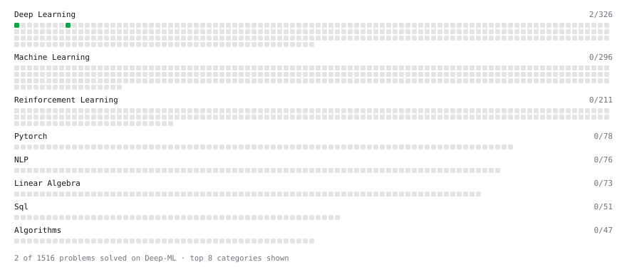

# Deep-ML

My machine learning practice from [Deep-ML](https://www.deep-ml.com). Every solution here was written by hand.

**3** solved · 0 problems · 0 labs · 3 math

[**Browse the interactive portfolio**](https://PranitSakhuja.github.io/deep-ml/) to replay this filling in over time.

## Math

| | Difficulty | Solved | |
| --- | --- | --- | --- |
| [Derivatives and Gradients](https://www.deep-ml.com/math-problems/1) | easy | 2026-10-07 | [solution](math/0001-derivatives-and-gradients) |
| [Gradient Descent Updates](https://www.deep-ml.com/math-problems/5) | easy | 2026-10-07 | [solution](math/0005-gradient-descent-updates) |
| [Information Theory: Entropy](https://www.deep-ml.com/math-problems/24) | medium | 2026-10-05 | [solution](math/0024-information-theory-entropy) |

---

_This file is regenerated by Deep-ML on every push._
